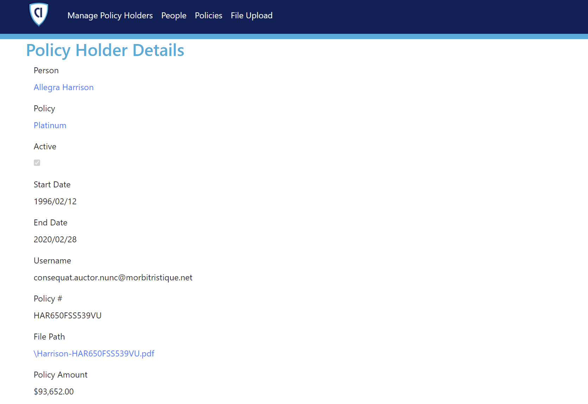

PaaS Management Hands-on lab  
March 2022

 

**Contents**

- [Exercise 1: Application Gateway の作成と監視](#exercise-1-Application Gateway の作成と監視])

  - [Task 1: Application Gateway の作成](#task-1-Application Gateway の作成)

  - [Task 2: Application Gateway の構成](#task-2-Application Gateway の構成)

 

### 使用する環境

 

### アプリケーションの動作確認

  - App Service の **概要** ページの **URL** をクリック

  - 新しいタブでアプリケーションが表示

    
  
  - **Managed Policy Holders** をクリック

    

    ※データベースからレコードを取得して表示
  
  - **Details** をクリックし、詳細情報を表示

    
  
  - **File Path** に表示される PDF ファイルへのリンクをクリック

    

    ※新しいタブで PDF ファイルが表示
  
  - 画面上部の **File Upload** をクリック

    

    ※ファイルのアップロードを行う画面が表示

 

## Exercise 1: サービス・リソース正常性

### Task 1: サービス正常性アラートの追加

- Azure ポータルのトップ画面から **検索バー** のテキストボックスに **正常性** と入力

- 表示される候補より **サービス正常性** を選択

  

- **＋ サービス正常性アラートの追加** をクリック

  

- **サブスクリプション**、**サービス**、**リージョン** を選択

  

- **Service Health の基準** セクションの **イベントの種類** から **サービスの問題**, **計画メンテナンス** を選択

  

- **アクション** セクションの **アクション グループの追加** をクリック

  
